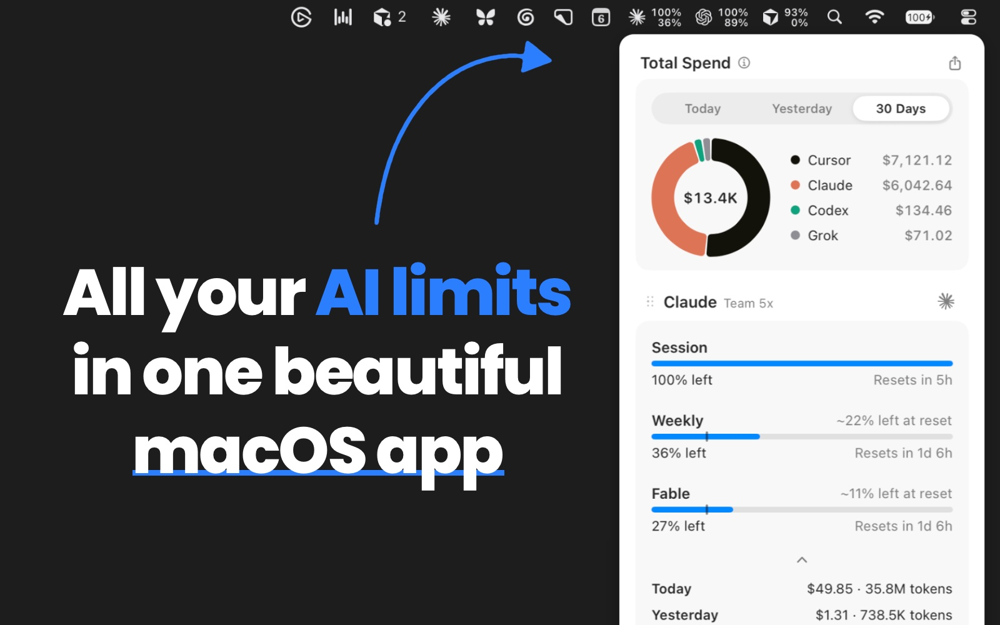

# OpenUsage

Track your AI coding subscriptions from the macOS menu bar — native Swift edition.

OpenUsage shows how much of your AI coding plans you've used: session and weekly limits, credits, and spend, all in one popover. Pin your most important metrics straight into the menu bar.

<p align="center">
  
</p>

## Supported Providers

- [**Claude**](docs/providers/claude.md) — session, weekly, Sonnet, extra usage, local daily spend (ccusage)
- [**Codex**](docs/providers/codex.md) — session, weekly, credits, local daily spend (ccusage)
- [**Cursor**](docs/providers/cursor.md) — credits, total/auto/API usage, requests, on-demand, per-day spend
- [**Devin**](docs/providers/devin.md) — weekly and daily quota, extra usage balance
- [**Grok**](docs/providers/grok.md) — credits used, pay-as-you-go

Each provider reads the credentials already on your machine (keychain, auth files, app state) — no extra login, and nothing leaves your Mac except the same API calls the vendor's own tools make.

## Features

- **Menu bar pins.** Pin metrics to the menu bar (up to 2 per provider); render as compact text or mini bars. The strip hides metrics with no data instead of showing placeholders.
- **Dashboard popover.** Provider-grouped meters with live reset countdowns, pace indicators, and context menus (pin, hide, used⟷left, countdown⟷exact resets, refresh).
- **Global shortcut.** Toggle the popover from anywhere — record any combo in Settings.
- **Customize.** Add/remove widgets, drag-reorder providers and metrics.
- **Stale-while-revalidate.** Cached values display instantly at launch; refresh runs every 5 minutes.
- **[Local HTTP API](docs/local-http-api.md).** Other apps can read your usage as JSON from `127.0.0.1:6736` (`/v1/usage`), same format as the original app. It is loopback-only and serves usage numbers, never credentials; note that browser pages can read it too — see the [privacy note](docs/local-http-api.md#cors-and-privacy).
- **[Proxy support](docs/proxy.md).** Route provider requests through SOCKS5 or HTTP(S) via `~/.openusage/config.json`.
- **Native settings.** Launch at login, global shortcut, menu style, theme, density, 12/24-hour time — see [Settings](docs/settings.md).
- **[Automatic updates](docs/updates.md).** Signed, notarized in-app updates via Sparkle, with an optional early access channel.

## Documentation

Behavior docs live in [docs/](docs/README.md): the [dashboard](docs/dashboard.md), [menu bar pins](docs/menu-bar.md), [settings](docs/settings.md), [refresh & caching](docs/refreshing.md), the [local HTTP API](docs/local-http-api.md), the [proxy](docs/proxy.md), and one page per provider.

For working on the code, see the developer docs: [architecture](docs/architecture.md), [adding a provider](docs/adding-a-provider.md), and [debugging & capturing logs](docs/debugging.md).

## Requirements

- macOS 15 (Sequoia) or later
- Universal binary — runs natively on both Apple Silicon and Intel Macs
- [Bun](https://bun.sh) — optional, only for the local Today / Yesterday / Last 30 Days spend tiles (runs `bunx ccusage`)

## Building

```sh
swift build            # debug build
swift test             # run the test suite
./script/build_and_run.sh   # build and launch the dev app from dist/ (no install)
```

## Architecture

SwiftPM executable, SwiftUI content hosted in an AppKit-owned `NSStatusItem` + `NSPopover`, Swift 6 strict concurrency. Providers implement a small `ProviderRuntime` protocol (auth store → usage client → mapper → `ProviderSnapshot`), and the UI renders normalized `MetricLine` values — see the [architecture overview](docs/architecture.md) for how the pieces fit together and [AGENTS.md](AGENTS.md) for engineering conventions.

## Releasing

Releases are automated: pushing a `v*` tag builds, signs, notarizes, and publishes a new version. The pipeline lives in [.github/workflows/release.yml](.github/workflows/release.yml).

## Contributing

Issues and PRs are welcome — read [CONTRIBUTING.md](CONTRIBUTING.md) first; the quality bar is deliberately high. Report security issues privately per [SECURITY.md](SECURITY.md). The OpenUsage name and logo are covered by the [trademark policy](TRADEMARK.md).

## License

[MIT](LICENSE)
